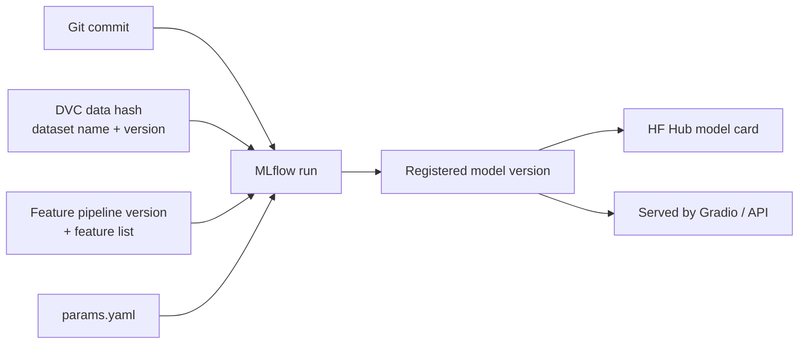

# CLAUDE.md — Credit Card Fraud Detection

This file is the source of truth for this project. Read it fully at the start of every session. It holds the project context, working rules and the Phase 0 checklist. The detailed plans and task checklists for Phases 1–7 live in `docs/plan.md`; read the section for the current phase before starting it.

## Project summary

We are building a fraud classifier for credit card transactions using classical ML. Work starts in Jupyter notebooks with a logistic regression baseline and moves up to gradient boosting. The chosen model ships first as a Gradio demo on Hugging Face Spaces. It then ships as a full-stack app: a Next.js frontend on Vercel and a FastAPI backend on Render, with production monitoring.

This is a portfolio project, built to the standard of a system that could support real decisions. Reproducibility, lineage and documentation are requirements, not extras.

## Decisions (settled — do not change without asking the owner)

| Area | Decision |
| --- | --- |
| Primary data | Sparkov simulated credit card transactions (~1.85M rows, ~0.5% fraud, Jan 2019–Dec 2020, CC0 licence) |
| Secondary data | Kaggle ULB European cardholders (PCA features V1–V28), added in Phase 7 as a benchmark only |
| Models | Logistic regression baseline, then progressively more complex classical models |
| Error priority | Missed fraud (FN) costs far more than a false alarm (FP) |
| False-alarm budget | **Precision ≥ 0.50 on validation** (confirmed) — at most one false alarm per caught fraud |
| Explainability | Required per prediction (SHAP) |
| Demo inputs | Single-transaction form and CSV batch scoring |
| Demo host | Hugging Face Spaces |
| Full-stack hosting | Next.js on Vercel; FastAPI on Render (or another free host) |
| Access model | **Public demo protected by an API key; no user accounts** (confirmed) |
| MLOps | MLflow tracking + registry, DVC data versioning, free remotes, production monitoring |
| Timeline | No deadline; phases are ordered by dependency |

**Out of scope:** deep learning, real payment-network integration, user accounts/authentication beyond the API key, real cardholder data.

## Working rules for Claude Code

- Work one phase at a time, in order. Finish the phase's checklist and deliverables before starting the next. Ask the owner before skipping ahead.
- When a task is done, tick its checkbox (Phase 0 here, Phases 1–7 in `docs/plan.md`) and update the "Current status" section.
- Anything a model depends on lives in `src/fraud/` and runs through DVC. Notebooks are for exploration and reporting only; they import from `src/fraud/` rather than defining pipeline logic.
- Every tunable value goes in `params.yaml`. No magic numbers in code.
- Use the global seed from `params.yaml` for every estimator, split and sampler.
- **Never** evaluate on the test split before Phase 3, step 5. Never tune anything on it.
- **Never** use random train/test splits on Sparkov. Splits are time-based.
- Any feature that uses card history must only look backwards in time.
- Never commit data, model binaries, `.env` files or credentials. Data goes through DVC; secrets go in `.env` (git-ignored) and GitHub secrets.
- Training scripts must refuse to run on a dirty git tree and must log the lineage tags listed below.
- Every script must run on CPU. GPU is an optional speed-up only.
- Bump the feature pipeline version according to the semver rules below whenever feature code changes.
- Add or update tests with every change to `src/fraud/`. Run `pytest` and `ruff` before declaring a task done.
- Record significant design decisions as short ADRs in `docs/adr/`.
- Keep the README current at the end of each phase and create the phase's git tag.
- If a requirement here is ambiguous or seems wrong, stop and ask rather than guess.

## Common commands

**Planned, not yet working:** none of these entry points exist until Phase 0 creates `pyproject.toml`, `dvc.yaml` and the rest. Treat this list as the target.

```bash
uv sync                      # install locked dependencies
dvc pull                     # fetch data and artefacts from the DagsHub remote
dvc repro                    # rebuild the pipeline (ingest → clean → split → features → train → evaluate)
dvc push                     # upload new data/artefacts
pytest                       # tests
pytest tests/path/test_x.py::test_name   # a single test
pytest -k "<expr>"                       # tests matching a name expression
dvc repro <stage>            # rebuild one stage (and what it depends on)
ruff check . && ruff format . && mypy src
pre-commit run --all-files
uvicorn api.main:app --reload   # run the API locally (Phase 5)
python demo/app.py              # run the Gradio demo locally (Phase 4)
```

Update this list as real entry points are created.

## Tech stack and remotes

DagsHub is the hub: one free account gives a git mirror, a DVC remote and a hosted MLflow server. GitHub is the source of truth for code and CI. Free-tier limits change; record the current limits in `docs/infra.md` during Phase 0.

| Concern | Tool | Remote / host |
| --- | --- | --- |
| Code, CI | Git, GitHub Actions | GitHub (mirrored to DagsHub) |
| Data versioning | DVC | DagsHub DVC remote |
| Pipeline orchestration | `dvc.yaml` stages + `params.yaml` | Same repo |
| Experiment tracking | MLflow | DagsHub hosted MLflow server |
| Model registry | MLflow Model Registry (aliases `champion`, `challenger`) | DagsHub MLflow |
| Published model artifacts | Model card + pipeline bundle | Hugging Face Hub model repo |
| Environment | Python 3.11, `uv` lockfile, `pyproject.toml` | Pinned in repo |
| Modeling | scikit-learn, imbalanced-learn, LightGBM, XGBoost, Optuna | Colab (GPU optional) or local |
| Explainability | SHAP | Pipeline and API |
| Data validation | Pandera schemas | Pipeline and API |
| Demo | Gradio | Hugging Face Spaces |
| Backend | FastAPI, Pydantic, Docker | Render free web service |
| Frontend | Next.js, TypeScript, Tailwind | Vercel |
| Prediction log + card history | Postgres | Neon or Supabase free tier |
| Monitoring | Evidently | Scheduled GitHub Action + report page |
| Quality | pytest, ruff, mypy, pre-commit | GitHub Actions |

- **GPU:** tree models on ~1.85M rows train in minutes on CPU. Use GPU (XGBoost `device="cuda"` on Colab) only for large Optuna searches.
- **Render:** free services sleep when idle. The frontend must show a "waking up the model" state on slow first requests.

## Repository structure

One monorepo, so a single commit pins everything that produced a model. The local directory is `credit-card-fraud-detector`; the GitHub repo is `webmaster99-stack/credit-card-fraud-detection` (`fraud-detection/` below is a placeholder root).

```
fraud-detection/
├── data/                 # DVC-tracked, never committed to git
│   ├── raw/sparkov/      # original CSVs
│   ├── raw/ulb/          # Phase 7
│   ├── interim/          # cleaned, PII dropped
│   └── processed/        # time-based splits
├── notebooks/            # 01_eda, 02_baseline, 03_models, 04_threshold, 05_explain
├── src/fraud/
│   ├── data/             # ingest, clean, split, Pandera schemas
│   ├── features/         # transformers (the versioned pipeline)
│   ├── models/           # train, tune, evaluate, register
│   ├── explain/          # SHAP helpers
│   └── serving/          # load champion, predict, explain (shared by Gradio and API)
├── demo/                 # Gradio app for HF Spaces
├── api/                  # FastAPI service + Dockerfile
├── web/                  # Next.js frontend
├── monitoring/           # Evidently jobs, drift replay script
├── tests/
├── docs/                 # ADRs, model cards, data cards, runbook, infra notes
├── dvc.yaml  params.yaml  pyproject.toml  uv.lock
├── CLAUDE.md
└── README.md
```

## Model lineage (mandatory)

Every registered model version must answer four questions from its MLflow tags alone: which code, which data, which features, which pipeline version.



The API returns the model version and pipeline version with every prediction, so each logged prediction traces back to this chain.

**Logged on every MLflow run** (implement once as a helper in `src/fraud/models/`):

| Tag or artifact | Example | Purpose |
| --- | --- | --- |
| `git_commit` | `a1b2c3d` | Exact code |
| `dataset_name`, `dataset_version` | `sparkov`, `v1` | Which data |
| `dvc_data_md5` | hash of `data/processed` from `dvc.lock` | Proves the exact files |
| `pipeline_version` | `features-1.2.0` (semver in `src/fraud/features/__init__.py`) | Which preprocessing code |
| `feature_list.json` | artifact: final columns and dtypes | Which features |
| `split_spec` | train Jan 2019–Jun 2020, valid Jul–Sep 2020, test Oct–Dec 2020 | Which rows |
| `params.yaml`, `requirements.lock` | artifacts | Rebuild environment |
| Metrics, PR curve, confusion matrix, SHAP summary | artifacts | Evidence |

**Versioning rules**

- The deployable unit is one scikit-learn `Pipeline` (features + model), logged with an input signature, so preprocessing can never drift from the model.
- Pipeline semver: patch = bug fix, same output; minor = new feature added; major = changed output of an existing feature.
- A new dataset or dataset version is a new DVC-tracked folder plus a `dataset_version` bump, never an overwrite.
- A model card (`docs/model_cards/<version>.md`) is generated from the run's tags and published to the HF Hub model repo.

## Current status

- Current phase: **Phase 1 — Data ingestion, versioning and EDA** (not started; see `docs/plan.md`)
- Last completed tag: `v0.0-setup` (Phase 0)

Update this section as work progresses.

---

Phases 1–7 are in `docs/plan.md`.

## Phase 0 — Setup

**Goal:** an empty but fully wired repo, where a trivial run already appears in DagsHub MLflow with its git commit and data hash.

- [x] `git init` this directory (it is not a git repo yet; training, lineage tags and phase tags all need one), then create the GitHub repo, mirror to DagsHub, create HF Hub model repo and Space — *locations recorded in `docs/infra.md`; the Space runs on a free ZeroGPU slot (see the decision there)*
- [x] `pyproject.toml`, `uv.lock`, pre-commit (ruff, mypy), GitHub Actions running tests — *CI green on `main`*
- [x] `dvc init`, DagsHub DVC remote, credentials in `.env` (git-ignored) and GitHub secrets — *the remote is configured but transfers are untested until Phase 1 puts data under DVC*
- [x] MLflow tracking URI pointing to DagsHub; helper that stamps every run with the lineage tags — *smoke run `phase0-smoke` logged to DagsHub with all tags and artifacts; `dvc_data_md5` is `n/a` until Phase 1 creates `dvc.lock`*
- [x] Colab bootstrap notebook: clone, `uv sync`, `dvc pull`, set tracking URI — *`notebooks/00_colab_bootstrap.ipynb`; test run in Colab succeeded (owner-confirmed)*
- [x] Record current free-tier limits of DagsHub, HF, Render, Vercel and Neon in `docs/infra.md`

## Risks

| Risk | Impact | Mitigation |
| --- | --- | --- |
| Sparkov is too easy; metrics look unrealistically high | Weakens credibility | State it in README and model card; ULB benchmark; error analysis |
| Train/serve skew in features | Wrong scores in production | Shared `serving` package, parity tests, logged input signature |
| Leakage from future transactions | Inflated metrics | Time-based splits, backward-only windows, test set used once |
| Free-tier limits or policy changes | Outages, lost artefacts | Record limits in Phase 0; everything rebuildable from git + DVC |
| Render cold starts | Slow first request | Wake-up state in UI; optional uptime ping |
| SHAP too slow for batch requests | Slow API | TreeExplainer; explain only flagged rows in batch mode |

## Definition of done

- [ ] A stranger can clone the repo, run `dvc pull && dvc repro`, and get the same metrics
- [ ] Every registered model shows its commit, dataset version, pipeline version and feature list
- [ ] Champion meets precision ≥ 0.50 on the untouched test set
- [ ] Gradio Space and full-stack app both live, serving the same model version
- [ ] Monitoring page shows the drift replay being detected
- [ ] README, data cards, model cards, ADRs and runbook complete
