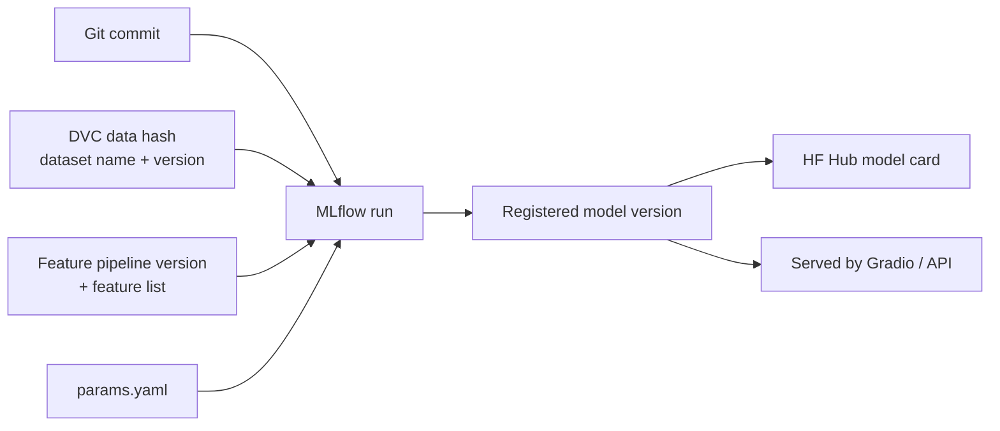

# CLAUDE.md — Credit Card Fraud Detection

This file is the source of truth for this project. Read it fully at the start of every session. It holds the project context, working rules and the Phase 0 checklist. The detailed plans and task checklists for Phases 1–7 live in `docs/plan.md`; read the section for the current phase before starting it.

## Project summary

We are building a fraud classifier for credit card transactions using classical ML. Work starts in Jupyter notebooks with a logistic regression baseline and moves up to gradient boosting. The chosen model ships first as a Gradio demo on Hugging Face Spaces. It then ships as a full-stack app: a Next.js frontend on Vercel and a FastAPI backend on Render, with production monitoring.

This is a portfolio project, built to the standard of a system that could support real decisions. Reproducibility, lineage and documentation are requirements, not extras.

## Decisions (settled — do not change without asking the owner)

| Area | Decision |
| --- | --- |
| Primary data | Sparkov simulated credit card transactions (~1.85M rows, ~0.5% fraud, Jan 2019–Dec 2020, CC0 licence) |
| Secondary data | Kaggle ULB European cardholders (PCA features V1–V28), added in Phase 7 as a benchmark only |
| Models | Logistic regression baseline, then progressively more complex classical models |
| Error priority | Missed fraud (FN) costs far more than a false alarm (FP) |
| False-alarm budget | **Precision ≥ 0.50 on validation** (confirmed) — at most one false alarm per caught fraud |
| Explainability | Required per prediction (SHAP) |
| Demo inputs | Single-transaction form and CSV batch scoring |
| Demo host | Hugging Face Spaces |
| Full-stack hosting | Next.js on Vercel; FastAPI on Render (or another free host) |
| Access model | **Public demo protected by an API key; no user accounts** (confirmed) |
| MLOps | MLflow tracking + registry, DVC data versioning, free remotes, production monitoring |
| Timeline | No deadline; phases are ordered by dependency |

**Out of scope:** deep learning, real payment-network integration, user accounts/authentication beyond the API key, real cardholder data.

## Working rules for Claude Code

- Work one phase at a time, in order. Finish the phase's checklist and deliverables before starting the next. Ask the owner before skipping ahead.
- When a task is done, tick its checkbox (Phase 0 here, Phases 1–7 in `docs/plan.md`) and update the "Current status" section.
- Anything a model depends on lives in `src/fraud/` and runs through DVC. Notebooks are for exploration and reporting only; they import from `src/fraud/` rather than defining pipeline logic.
- Every tunable value goes in `params.yaml`. No magic numbers in code.
- Use the global seed from `params.yaml` for every estimator, split and sampler.
- **Never** evaluate on the test split before Phase 3, step 5. Never tune anything on it.
- **Never** use random train/test splits on Sparkov. Splits are time-based.
- Any feature that uses card history must only look backwards in time.
- Never commit data, model binaries, `.env` files or credentials. Data goes through DVC; secrets go in `.env` (git-ignored) and GitHub secrets.
- Training scripts must refuse to run on a dirty git tree and must log the lineage tags listed below.
- Every script must run on CPU. GPU is an optional speed-up only.
- Bump the feature pipeline version according to the semver rules below whenever feature code changes.
- Add or update tests with every change to `src/fraud/`. Run `pytest` and `ruff` before declaring a task done.
- Record significant design decisions as short ADRs in `docs/adr/`.
- Keep the README current at the end of each phase and create the phase's git tag.
- If a requirement here is ambiguous or seems wrong, stop and ask rather than guess.

## Common commands

**Working now:** `uv sync`, `dvc pull`/`dvc push`, `dvc repro` (ingest, clean, split, features, train, train_demo, evaluate), `pytest`, `ruff`, `mypy`, `pre-commit`, the Gradio demo (`FRAUD_MODEL_SOURCE=data/bundle uv run python demo/app.py`, after `uv run python -m fraud.serving.export`), `uv run python demo/build_space.py` to stage the Space folder, and the `uvicorn` entry point (`api/`, Phase 5) locally against `docker-compose.yml`'s Postgres (needs `DATABASE_URL`, `API_KEY` in `.env`; deployed to Render with Neon — `docs/infra.md`). The Next.js frontend (`web/`, `cd web && npm run dev`, needs `web/.env.local`; deployed to Vercel). Run `dvc` through `uv run dvc ...` unless the venv is activated. `dvc repro ingest` needs a Kaggle token (`KAGGLE_API_TOKEN` or `KAGGLE_ACCESS_TOKEN` in `.env`).

```bash
uv sync                      # install locked dependencies
dvc pull                     # fetch data and artefacts from the DagsHub remote
dvc repro                    # rebuild the pipeline (ingest → clean → split → features → train → evaluate)
dvc push                     # upload new data/artefacts
pytest                       # tests
pytest tests/path/test_x.py::test_name   # a single test
pytest -k "<expr>"                       # tests matching a name expression
dvc repro <stage>            # rebuild one stage (and what it depends on)
ruff check . && ruff format . && mypy src api
pre-commit run --all-files
docker compose up -d db         # local Postgres for the API (port 5433; see docker-compose.yml)
uv run uvicorn api.main:app --reload   # run the API locally (Phase 5; needs DATABASE_URL, API_KEY in .env)
python demo/app.py              # run the Gradio demo locally (Phase 4; FRAUD_MODEL_SOURCE=data/bundle for a local export)
uv run --group monitoring python -m monitoring.nightly   # the nightly checks (needs DATABASE_URL; also runs in GitHub Actions)
uv run python -m monitoring.replay --rows 300 [--shift]  # drift replay against the live API (needs API_URL, API_KEY, DATABASE_URL)
uv run dvc repro --single-item monitoring_reference      # rebuild the drift reference without rerunning upstream stages
```

Update this list as real entry points are created.

## Tech stack and remotes

DagsHub is the hub: one free account gives a git mirror, a DVC remote and a hosted MLflow server. GitHub is the source of truth for code and CI. Free-tier limits change; record the current limits in `docs/infra.md` during Phase 0.

| Concern | Tool | Remote / host |
| --- | --- | --- |
| Code, CI | Git, GitHub Actions | GitHub (mirrored to DagsHub) |
| Data versioning | DVC | DagsHub DVC remote |
| Pipeline orchestration | `dvc.yaml` stages + `params.yaml` | Same repo |
| Experiment tracking | MLflow | DagsHub hosted MLflow server |
| Model registry | MLflow Model Registry (aliases `champion`, `challenger`) | DagsHub MLflow |
| Published model artifacts | Model card + pipeline bundle | Hugging Face Hub model repo |
| Environment | Python 3.11, `uv` lockfile, `pyproject.toml` | Pinned in repo |
| Modeling | scikit-learn, imbalanced-learn, LightGBM, XGBoost, Optuna | Colab (GPU optional) or local |
| Explainability | SHAP | Pipeline and API |
| Data validation | Pandera schemas | Pipeline and API |
| Demo | Gradio | Hugging Face Spaces |
| Backend | FastAPI, Pydantic, Docker | Render free web service |
| Frontend | Next.js, TypeScript, Tailwind | Vercel |
| Prediction log + card history | Postgres | Neon or Supabase free tier |
| Monitoring | Evidently | Scheduled GitHub Action + report page |
| Quality | pytest, ruff, mypy, pre-commit | GitHub Actions |

- **GPU:** tree models on ~1.85M rows train in minutes on CPU. Use GPU (XGBoost `device="cuda"` on Colab) only for large Optuna searches.
- **Render:** free services sleep when idle. The frontend must show a "waking up the model" state on slow first requests.

## Repository structure

One monorepo, so a single commit pins everything that produced a model. The local directory is `credit-card-fraud-detector`; the GitHub repo is `webmaster99-stack/credit-card-fraud-detection` (`fraud-detection/` below is a placeholder root).

```
fraud-detection/
├── data/                 # DVC-tracked, never committed to git
│   ├── raw/sparkov/      # original CSVs
│   ├── raw/ulb/          # Phase 7 (processed splits in data/processed_ulb/)
│   ├── interim/          # cleaned, PII dropped
│   └── processed/        # time-based splits
├── notebooks/            # 01_eda, 02_baseline, 03_models, 04_threshold, 05_explain
├── src/fraud/
│   ├── data/             # ingest, clean, split, Pandera schemas
│   ├── features/         # transformers (the versioned pipeline)
│   ├── models/           # train, tune, evaluate, register
│   ├── explain/          # SHAP helpers
│   └── serving/          # load champion, predict, explain (shared by Gradio and API)
├── demo/                 # Gradio app for HF Spaces
├── api/                  # FastAPI service + Dockerfile
├── web/                  # Next.js frontend
├── monitoring/           # Evidently jobs, drift replay script
├── tests/
├── docs/                 # ADRs, model cards, data cards, runbook, infra notes
├── dvc.yaml  params.yaml  pyproject.toml  uv.lock
├── CLAUDE.md
└── README.md
```

## Model lineage (mandatory)

Every registered model version must answer four questions from its MLflow tags alone: which code, which data, which features, which pipeline version.


```mermaid
flowchart LR
  A[Git commit] --> R[MLflow run]
  B[DVC data hash<br/>dataset name + version] --> R
  C[Feature pipeline version<br/>+ feature list] --> R
  D[params.yaml] --> R
  R --> M[Registered model version]
  M --> H[HF Hub model card]
  M --> S[Served by Gradio / API]
```

The API returns the model version and pipeline version with every prediction, so each logged prediction traces back to this chain.

**Logged on every MLflow run** (implement once as a helper in `src/fraud/models/`):

| Tag or artifact | Example | Purpose |
| --- | --- | --- |
| `git_commit` | `a1b2c3d` | Exact code |
| `dataset_name`, `dataset_version` | `sparkov`, `v1` | Which data |
| `dvc_data_md5` | hash of `data/processed` from `dvc.lock` | Proves the exact files |
| `pipeline_version` | `features-1.0.0` (semver in `src/fraud/features/__init__.py`; one version covers both tiers, `feature_set` v1/v2 tells them apart, ADR 0003) | Which preprocessing code |
| `feature_list.json` | artifact: final columns and dtypes | Which features |
| `split_spec` | train Jan 2019–Jun 2020, valid Jul–Sep 2020, test Oct–Dec 2020 | Which rows |
| `params.yaml`, `requirements.lock` | artifacts | Rebuild environment |
| Metrics, PR curve, confusion matrix, SHAP summary | artifacts | Evidence |

**Versioning rules**

- The deployable unit is one scikit-learn `Pipeline` (features + model), logged with an input signature, so preprocessing can never drift from the model.
- Pipeline semver: patch = bug fix, same output; minor = new feature added; major = changed output of an existing feature.
- A new dataset or dataset version is a new DVC-tracked folder plus a `dataset_version` bump, never an overwrite.
- A model card (`docs/model_cards/<version>.md`) is generated from the run's tags and published to the HF Hub model repo.

## Current status

- Phase 3 — Modeling experiments complete, tag `v0.3-model`. Champion:
  **lightgbm on v2 features** (recall 0.990 @ precision 0.50 on validation, PR-AUC 0.978), beating
  xgboost v2 (0.986) and every v1 model (best v1: xgboost, 0.921) — full ladder in
  `reports/model_ladder.json`, notebooks `02_baseline`-`05_explain`, deterministic `train`/`evaluate`
  dvc.yaml stages reproduce it. Single test-set evaluation done (owner-approved): recall 0.986 (CI
  0.978-0.993), but **precision 0.446 (CI 0.423-0.468) is below the 0.50 validation target** — a
  prevalence effect (fraud fell from 0.44% to 0.33%; recall and false-alarm rate held), documented
  rather than fixed by re-tuning against test (see `docs/model_cards/v0.3-model.md`). `fraud-classifier` registered on DagsHub MLflow: v1 (lightgbm
  v2) `@champion`, v2 (xgboost v2) `@challenger`.
- Current phase: **Phase 4 — Packaging and Gradio demo** complete, tag `v0.4-demo`. The Space is live and verified on
  ZeroGPU (`docs/infra.md`). The demo serves a stateless v1 model, not the champion (ADR 0004): registry
  `fraud-classifier` v3 (xgboost v1, recall 0.921 @ precision 0.50 on validation) under alias `demo`,
  trained by the `train_demo` dvc stage; `champion`/`challenger` untouched. `src/fraud/serving/`
  (`load_model`/`predict`/`explain`), `python -m fraud.serving.export` (bundle + model card, `--push` for
  the HF Hub), `demo/app.py`, `demo/build_space.py`. Bundle pushed to the HF Hub model repo; Space deployed
  (ZeroGPU builds on Python 3.12.12, not 3.11; the unused `spaces.GPU` startup probe works but was not tested
  without).
- Current phase: **Phase 5 — Full-stack app** complete, tag `v1.0`. The FastAPI backend (`api/`:
  `/v1/predict`, `/v1/predict/batch`, `/v1/feedback`, `/v1/model`, `/health`; `db.py` + `schema.sql` where one
  table is both the prediction log and the online per-card history store — ADR 0005; API-key auth,
  `slowapi` rate limiting, structured JSON logs) serves the champion (`lightgbm`, v2 features, pushed to its own
  HF Hub branch via `fraud.serving.export --alias champion --push`, `MODEL_REVISION=champion`), and its tests
  pass against a real Postgres. **Live on Render** (free plan, Docker runtime) at
  `https://credit-card-fraud-detection-5reg.onrender.com`, backed by Neon Postgres; the Next.js frontend
  (`web/`) is live on Vercel as `fraud-classifier-web` (https://fraud-classifier-web.vercel.app), with every
  call going through `web/app/api/*` route handlers so the API key never reaches the browser. Verified:
  `/health`, `/v1/model`, `/v1/predict` and `/v1/predict/batch` (JSON and CSV) against the live API with the
  rotated `API_KEY`, and the frontend's model info page (owner-confirmed). Getting the image to serve
  needed three fixes (`docs/infra.md`): `README.md` and `params.yaml` copied into the image
  (`FRAUD_PARAMS_PATH` points `fraud.params` at the latter, because the non-editable install has no repo
  root), `libgomp1` installed, and the Postgres pool validating connections on checkout
  (`check_connection`) because Neon drops idle ones. Render auto-deploy is off; CI deploys on `v*` tag
  pushes via `RENDER_DEPLOY_HOOK_URL`, first exercised by the `v1.0` tag. Earlier fixes: `write_bundle`
  couldn't build a v2 bundle's `feature_list.json`, and `trans_ts` round-tripped through `TIMESTAMPTZ`
  broke concatenation with naive request rows (now `TIMESTAMP`). Known gaps, carried forward:
  the champion's decision threshold is very low (0.000305) and the ordinary test transaction scored just
  under it (test precision 0.446 is a prevalence effect, see the Definition of done); the local `docker build` was run on 2026-10-01 (375 s, image 5.27 GB): it serves the champion against the compose Postgres, matches the live API's prediction exactly, and returns 401 without the key.
  The frontend's predict and batch pages were tested end-to-end on 2026-10-01 (live; cold-start handling added in
  `web/`), and `ALLOWED_ORIGINS` is set to the Vercel URL on Render. See
  `docs/plan.md` for the task list.
- Current phase: **Phase 6 — Monitoring** complete, tag `v1.1-monitoring`, plus patch `v1.1.1`.
  `src/fraud/monitoring/` (PSI/Wasserstein/alert logic, thresholds in `params.yaml`), nightly GitHub
  Action (`monitoring/nightly.py`, secrets `DATABASE_URL` + the DagsHub credentials; fails when an
  alert fires), `monitoring/replay.py`, `monitoring_reference` dvc stage (reference pushed to the DVC
  remote), `/v1/monitoring/{nightly,replay}` and `/v1/monitoring/nightly/report` endpoints,
  `api_requests` and `monitoring_reports` tables, web `/monitoring` page, `docs/runbook.md`, ADR 0006.
  Verified live: the nightly workflow (green, Evidently report rendered and stored), both replays
  against the live API (clean: no drift; amounts x3: `amt` PSI 1.29 flagged) and the `/monitoring`
  page on Vercel. `v1.1.1` added `?source=replay` on the batch endpoint: replay rows are logged as
  `replay` and excluded from the nightly checks (the first 900 were relabelled by a one-off UPDATE).
  The Evidently HTML is ~4 MB whatever the sample size (its JS bundle), so the web route sends it
  gzipped (Vercel's function response cap is ~4.5 MB). Report retention is `keep_reports: 14` (~4 MB
  each, sized for Neon's 0.5 GB, `docs/infra.md`). Known gaps: a single small category's amount shift
  is too subtle to trip PSI (the replay's default shifts all amounts); small daily samples on
  high-cardinality features (`state`) sit near the 0.25 PSI threshold. A plain `dvc repro` reruns
  `train` (stale deps) and deletes its outputs before the dirty-tree guard stops it; use
  `dvc repro --single-item <stage>` for one stage.
- Current phase: **Phase 7 — ULB secondary dataset** complete, tag `v1.2-ulb`. `src/fraud/ulb/`, dvc stages
  `ulb_ingest`/`ulb_split`/`ulb_train`, `features-ulb-1.0.0`, data card `docs/data_cards/ulb.md`, ADR 0007.
  Split by Time (train <28 h, valid 28-40 h, test after; 333/82/77 frauds), untuned rungs; validation
  recall @ precision 0.50: xgboost 0.817 (winner), random forest 0.817, lightgbm 0.805, logreg 0.793.
  Single test evaluation (`python -m fraud.ulb.evaluate_test`): recall 0.792 (CI 0.699-0.877), precision
  0.550 (CI 0.457-0.637), PR-AUC 0.803, so precision >= 0.50 is met but the CI spans it. Registered as
  `fraud-ulb` v1 `@champion` on DagsHub MLflow; never served. README has the synthetic-vs-real table.
  LightGBM needed `scale_pos_weight` 1.0 (10 diverged). All seven phases are done; the Definition of
  done items above still open are the project's remaining work.
- Last completed tag: `v1.2-ulb` (Phase 7), `v1.1.1` (Phase 6 patch), `v1.1-monitoring` (Phase 6); earlier: `v1.0` (Phase 5), `v0.4-demo` (Phase 4), `v0.3-model` (Phase 3),
  `v0.2-features` (Phase 2), `v0.1-eda` (Phase 1), `v0.0-setup` (Phase 0)

Update this section as work progresses.

---

Phases 1–7 are in `docs/plan.md`.

## Phase 0 — Setup

**Goal:** an empty but fully wired repo, where a trivial run already appears in DagsHub MLflow with its git commit and data hash.

- [x] `git init` this directory (it is not a git repo yet; training, lineage tags and phase tags all need one), then create the GitHub repo, mirror to DagsHub, create HF Hub model repo and Space — *locations recorded in `docs/infra.md`; the Space runs on a free ZeroGPU slot (see the decision there)*
- [x] `pyproject.toml`, `uv.lock`, pre-commit (ruff, mypy), GitHub Actions running tests — *CI green on `main`*
- [x] `dvc init`, DagsHub DVC remote, credentials in `.env` (git-ignored) and GitHub secrets — *the remote is configured but transfers are untested until Phase 1 puts data under DVC*
- [x] MLflow tracking URI pointing to DagsHub; helper that stamps every run with the lineage tags — *smoke run `phase0-smoke` logged to DagsHub with all tags and artifacts; `dvc_data_md5` is `n/a` until Phase 1 creates `dvc.lock`*
- [x] Colab bootstrap notebook: clone, `uv sync`, `dvc pull`, set tracking URI — *`notebooks/00_colab_bootstrap.ipynb`; test run in Colab succeeded (owner-confirmed)*
- [x] Record current free-tier limits of DagsHub, HF, Render, Vercel and Neon in `docs/infra.md`

## Risks

| Risk | Impact | Mitigation |
| --- | --- | --- |
| Sparkov is too easy; metrics look unrealistically high | Weakens credibility | State it in README and model card; ULB benchmark; error analysis |
| Train/serve skew in features | Wrong scores in production | Shared `serving` package, parity tests, logged input signature |
| Leakage from future transactions | Inflated metrics | Time-based splits, backward-only windows, test set used once |
| Free-tier limits or policy changes | Outages, lost artefacts | Record limits in Phase 0; everything rebuildable from git + DVC |
| Render cold starts | Slow first request | Wake-up state in UI; optional uptime ping |
| SHAP too slow for batch requests | Slow API | TreeExplainer; explain only flagged rows in batch mode |

## Definition of done

- [x] A stranger can clone the repo, run `dvc pull && dvc repro`, and get the same metrics — *verified from a fresh clone on 2026-10-01: pipeline up to date after `dvc pull`, forced retrain reproduced the metrics exactly. Caveat: retrained model binaries and the last float digit (~1e-16) of some report values are not bit-identical, so `evaluate` shows stale after a retrain. `.gitattributes` pins LF and scripts write LF so `dvc.lock` hashes match across OSes*
- [x] Every registered model shows its commit, dataset version, pipeline version and feature list — *checked 2026-10-01 across `fraud-classifier` v1-v3 and `fraud-ulb` v1; `feature_list.json` was backfilled on the three `fraud-classifier` runs from git (tagged `feature_list_source`) and `train` now logs it; `dvc_data_md5` on v1-v3 is historical (`docs/infra.md`)*
- [x] Champion meets precision ≥ 0.50 on validation, and the test result is explained — *owner decision 2026-10-01: the target is a validation threshold rule and is met (0.500). Test precision is 0.446 (CI 0.423-0.468), below 0.50, because fraud prevalence fell from 0.44% to 0.33%; recall (0.990 → 0.986) and false-alarm rate (0.438% → 0.408%) held or improved. At validation rates and test prevalence precision would be 0.430. Documented in `docs/model_cards/v0.3-model.md`, not re-tuned (test is spent)*
- [x] Gradio Space and full-stack app both live, sharing one serving codebase and registry — *owner decision 2026-10-01: they deliberately serve different models. The Space serves the stateless v1 `demo` model (`fraud-classifier` v3) and the API serves the history-aware champion (v1), both through `fraud.serving` (ADR 0004, addendum). Not aligned because the champion is worse without card history*
- [x] Monitoring page shows the drift replay being detected — *live on Vercel, `amt` flagged in the shifted replay*
- [x] README, data cards, model cards, ADRs and runbook complete — *audited 2026-10-01: added the ULB model card (`docs/model_cards/ulb-v1.2.md`), refreshed the README status and pipeline sections, and aligned the precision wording everywhere; the model card already on the HF Hub still has the old precision sentence until the next `export --push`*
