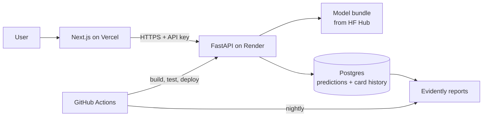

# Phase plan (Phases 1–7)

Detailed plan and task checklists for Phases 1–7. Phase 0 and the project rules live in `CLAUDE.md`. Tick a task here when it is done, then update "Current status" in `CLAUDE.md`.

## Phase 1 — Data ingestion, versioning and EDA

**Goal:** raw Sparkov data under DVC, a cleaned and validated table, time-based splits, and an EDA notebook that motivates every feature.

**Pipeline stages (`dvc.yaml`)**

1. `ingest` — download Sparkov CSVs to `data/raw/sparkov/`; record source URL and licence (CC0) in a data card.
2. `clean` — parse timestamps and types; drop direct identifiers (`first`, `last`, `street`, `trans_num`); replace `cc_num` with a salted hash `card_id` used only for per-card features; validate with a Pandera schema.
3. `split` — time-based: train Jan 2019–Jun 2020, validation Jul–Sep 2020, test Oct–Dec 2020. The test set is touched once, at the end of Phase 3.

Time-based splits are required because in production the model scores the future. Random splits leak future card behaviour into training and inflate metrics.

**EDA questions (`notebooks/01_eda.ipynb`)**

- Fraud rate overall, by month, by category, by hour and weekday
- Amount distributions for fraud vs legitimate, per category
- Customer–merchant distance, customer age, city population vs fraud
- How fraud clusters within a card (bursts of transactions)
- Signs of simulator artefacts that make the task too easy; document them honestly
- Duplicates, missing values and time gaps

**Tasks**

- [x] `ingest`, `clean`, `split` stages implemented and wired in `dvc.yaml`
- [x] Pandera schema for the cleaned table, with tests
- [x] EDA notebook with written conclusions
- [x] Data card `docs/data_cards/sparkov.md`
- [x] ADRs: "why Sparkov", "why time-based split"
- [x] README updated; tag `v0.1-eda`

## Phase 2 — Feature engineering pipeline

**Goal:** a versioned scikit-learn pipeline that produces identical features in training, in the Gradio demo and in the API.

| Group | Features | Needs card history? |
| --- | --- | --- |
| Transaction | log amount, category, hour, weekday, night flag | No |
| Customer | age at transaction, gender, log city population, state | No |
| Geography | customer–merchant distance (haversine) | No |
| Velocity | transactions and spend in the last 1 h / 24 h / 7 d per card | Yes |
| Behavioural | amount vs card's average amount; time since last transaction; first use of this category | Yes |

**Card history is handled in two tiers:**

- **v1 pipeline (stateless):** only Transaction, Customer and Geography features. The form and CSV work without history. This is the first model shipped.
- **v2 pipeline (stateful):** adds the history features. Offline, compute them with time-ordered, backward-only windows. Online, the API keeps a small per-card history in Postgres. CSV batches compute them within the uploaded file, sorted by time.

The v1 vs v2 comparison is itself a reported result: how much recall do history features buy?

**Rules**

- Encoders and scalers are fitted on the training split only, inside the pipeline.
- High-cardinality columns (merchant, job, city) are target-encoded with cross-fitting, or dropped if they add nothing.
- Every transformer has unit tests, including a train-vs-serve parity test on the same rows.
- `feature_list.json` is produced by the pipeline itself.

**Tasks**

- [ ] v1 transformers in `src/fraud/features/` with tests
- [ ] v2 history transformers with leakage tests (no future rows used)
- [ ] Train/serve parity test
- [ ] `features` stage in `dvc.yaml`; pipeline version set
- [ ] README updated; tag `v0.2-features`

## Phase 3 — Modeling experiments

**Goal:** pick a champion model and a decision threshold using a fixed, written protocol.

**Primary metric:** recall at precision ≥ 0.50 on validation.
**Secondary:** PR-AUC, and expected cost with a missed fraud costing 20× a false alarm.
ROC-AUC and accuracy are reported but never used to choose; at 0.5% fraud they look good even for weak models.

**Model ladder** — each rung must beat the previous on the primary metric to earn its complexity.

| Step | Model | Imbalance handling | Purpose |
| --- | --- | --- | --- |
| 0 | Dummy (always legit), amount-rule heuristic | — | Floor to beat |
| 1 | Logistic regression (L2, scaled) | `class_weight` | Baseline; fully interpretable |
| 2 | Logistic regression + interactions, spline features | `class_weight` | How far can linear go? |
| 3 | Random forest | `class_weight`, balanced bootstrap | First non-linear model |
| 4 | LightGBM | `scale_pos_weight` | Usual winner on tabular data |
| 5 | XGBoost | `scale_pos_weight` | Cross-check against LightGBM |
| 6 | Isolation Forest (unsupervised) | — | How much do labels help? |

Resampling (SMOTE, undersampling) is an ablation on steps 1 and 4 only, applied inside the pipeline so it never touches validation rows.

**Protocol**

1. Tune on train, score on validation. Optuna, each trial logged as a nested MLflow run.
2. Calibrate probabilities (isotonic or sigmoid) on validation.
3. Choose the threshold on validation from the precision–recall curve, meeting precision ≥ 0.50.
4. Compare v1 vs v2 feature pipelines for the top two models.
5. Score the test set **once** with the chosen model and threshold. Report bootstrap confidence intervals.
6. Promote to `champion` in the MLflow registry; runner-up becomes `challenger`.

**Explainability**

- Global: SHAP summary and dependence plots; logistic regression coefficients as a sanity check.
- Local: SHAP values per prediction, turned into plain-language reasons (e.g. "amount 6× this card's average").
- Error analysis: read 20 missed frauds and 20 false alarms and write down patterns.
- Fairness: recall and false-alarm rate by age band and gender, reported in the model card.

**Tasks**

- [ ] `train` and `evaluate` stages in `dvc.yaml`
- [ ] Notebooks `02_baseline` through `05_explain`
- [ ] Ladder steps 0–6 run and logged
- [ ] Calibration and threshold selection
- [ ] v1 vs v2 comparison
- [ ] Single test-set evaluation with confidence intervals
- [ ] SHAP explanations and plain-language reason generator in `src/fraud/explain/`
- [ ] Error analysis and fairness check
- [ ] Model card; `champion`/`challenger` aliases set
- [ ] Comparison table in README; tag `v0.3-model`

## Phase 4 — Packaging and Gradio demo

**Goal:** a public Hugging Face Space that scores a single transaction or a CSV, explains each decision, and shows which model version answered.

**Packaging**

- `src/fraud/serving/` exposes `load_model()`, `predict(df)` and `explain(df)`. Gradio and FastAPI both use it, so they can never disagree.
- An export script pulls the `champion` from the registry and pushes the pipeline, threshold, `feature_list.json` and model card to the HF Hub model repo.
- The Space downloads that bundle at startup and needs no DVC or MLflow credentials.

**App layout (three tabs)**

| Tab | Inputs | Output |
| --- | --- | --- |
| Single transaction | Amount, category, date and time, customer DOB, gender, customer and merchant location (city picker fills lat/long) | Fraud probability, flag vs threshold, top 5 reasons (SHAP bar chart + plain text) |
| Batch CSV | Upload in the documented schema; template download | Table with score, flag and top reason per row; downloadable results; summary counts |
| About | — | Model version, pipeline version, dataset, test metrics, limitations, links to repo and model card |

A "Try an example" button loads real fraud and legitimate rows from the test set.

**Guardrails:** Pandera validation with readable errors; CSV size cap (e.g. 10,000 rows); serve the v1 stateless pipeline first.

**Tasks**

- [ ] `src/fraud/serving/` with tests
- [ ] Export script to HF Hub
- [ ] Gradio app in `demo/`
- [ ] CI smoke test: load bundle, score the template CSV
- [ ] Space deployed; README updated; tag `v0.4-demo`

## Phase 5 — Full-stack app

**Goal:** a Next.js frontend on Vercel calling a Dockerised FastAPI service on Render, with every prediction logged for monitoring. Public demo protected by an API key; no user accounts.

**API endpoints**

| Method | Path | Purpose |
| --- | --- | --- |
| POST | `/v1/predict` | One transaction → probability, flag, reasons, model and pipeline version, request id |
| POST | `/v1/predict/batch` | CSV or JSON list → per-row results |
| POST | `/v1/feedback` | Attach a true label to a past request id (delayed fraud label) |
| GET | `/v1/model` | Current model card summary |
| GET | `/health` | Liveness for Render and uptime checks |

**Backend:** Pydantic request models generated from the same schema as Pandera; model loaded once at startup; API key header; rate limiting; CORS restricted to the Vercel domain; structured JSON logs; Docker image built and tested in CI, deployed on tag.

**Frontend:** single-transaction form with reason cards; CSV upload with results table and download; model info page; monitoring page embedding the latest Evidently report. The frontend calls the API through a Next.js server route so the API key never reaches the browser.

**Tasks**

- [ ] FastAPI service in `api/` using `src/fraud/serving/`
- [ ] Postgres schema for predictions and card history
- [ ] Dockerfile and CI build/test/deploy to Render
- [ ] Next.js app in `web/` deployed to Vercel
- [ ] Integration tests against a local Docker container; OpenAPI docs
- [ ] README updated; tag `v1.0`

## Phase 6 — Monitoring

**Goal:** detect degradation before users do, with a written path from alert to retrained model.

Fraud labels arrive late (chargebacks take weeks), so monitoring runs on two clocks: input and score drift daily, true performance once labels arrive.

| Layer | What is watched | Signal | Alert when |
| --- | --- | --- | --- |
| Service | Latency, error rate, uptime | Logs, `/health` | Error rate > 1% or health check fails |
| Data quality | Schema violations, missing values, out-of-range inputs | Pandera failures per day | Failures > 0.5% of requests |
| Data drift | Distribution of each input feature vs training | Evidently drift report (PSI / Wasserstein) | Drift on key features for 3 days running |
| Prediction drift | Score distribution, flag rate | Evidently | Flag rate outside 0.5×–2× of validation |
| Performance | Recall, precision, PR-AUC on labelled requests | `/v1/feedback` labels joined to predictions | Recall drops > 10 points vs test |

**Drift replay demo:** a script replays the held-out months through the live API and posts labels with a delay. A second run injects shift (e.g. inflated amounts in one category). The monitoring page shows the drift being caught.

**Runbook (`docs/runbook.md`):** what each alert means, how to check it, when to retrain, how to promote a challenger. Retraining is manual at first: `dvc repro` on new data, compare against `champion`, promote only if it wins on the same protocol.

**Tasks**

- [ ] Nightly Evidently job (GitHub Action)
- [ ] Monitoring page in `web/`
- [ ] Drift replay script in `monitoring/`
- [ ] Runbook
- [ ] README updated; tag `v1.1-monitoring`

## Phase 7 — ULB secondary dataset

**Goal:** rerun the model ladder on real (anonymized) data as a benchmark and prove the lineage setup handles several datasets.

- [ ] Add `data/raw/ulb/` under DVC with its own data card and `dataset_name=ulb`
- [ ] Separate feature pipeline `features-ulb-1.0.0`: amount scaling and time-of-day only (V1–V28 are already PCA outputs)
- [ ] Same protocol: split by `Time` (earlier hours train, later hours test), same metric and precision ≥ 0.50 budget
- [ ] Register ULB models under their own name (`fraud-ulb`), never mixed with the served Sparkov model
- [ ] README side-by-side results: synthetic vs real data, and what the gap says

